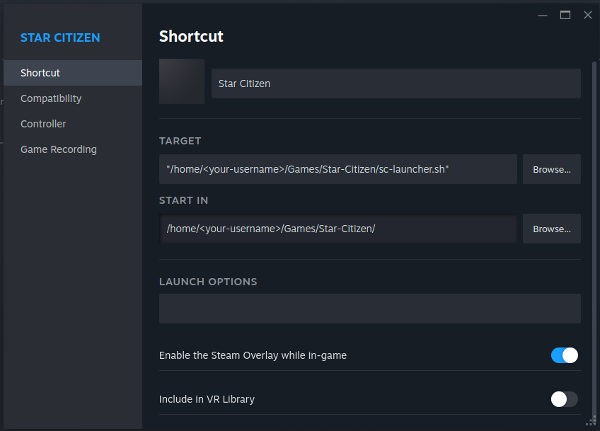
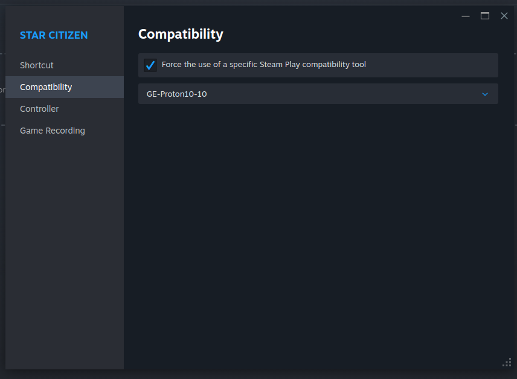
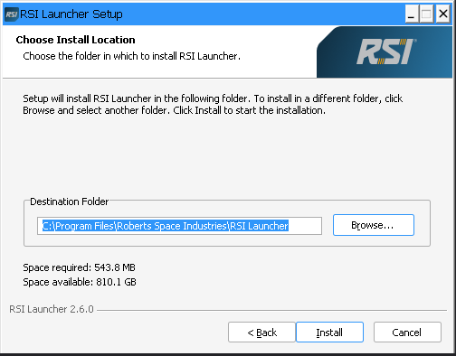
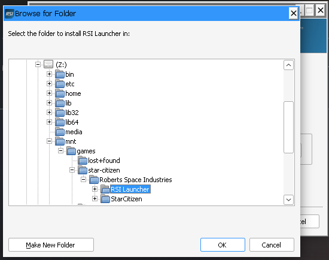
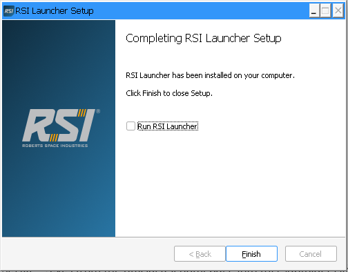

# sc-launcher

**Play Star Citizen on Linux with Steam & Proton**

## Overview

The `sc-launcher.sh` script simplifies installing and running *Star Citizen* and maintains the RSI Launcher from [RSI's download page](https://robertsspaceindustries.com/en/download) on Linux, using **Proton via Steam**.

* Other frameworks like **Lutris** or **Bottles** are not tested and are generally not compatible.
* Prefer Wine to Steam/Proton? Consider [lug-helper](https://github.com/starcitizen-lug/lug-helper).
* New to *Star Citizen*? Use my referral link to get 5000 UEC: [Join here](https://www.robertsspaceindustries.com/enlist?referral=STAR-K4DH-PCG3). You'll also get help joining my org: [NCFC](https://robertsspaceindustries.com/en/orgs/NCFC).
* Tested on **Fedora**, but should work on most Linux distributions (no distro-specific hacks included).

---

## Why Use Steam?

Running *Star Citizen* through Steam on Linux has key advantages:

* **Unified Library**: Keep all your games in Steam — no need to juggle Lutris, Bottles, or manual Wine setups.
* **Proton Integration**: Valve's Proton is optimized for compatibility and stability, especially with anti-cheat and new hardware.
* **Quick Fixes & Stability**: Wine patches may appear faster, but Proton already includes many workarounds. It's developed for Steam Deck, so stability and wide hardware support are a priority.
* **Shader Caching**: Steam manages Vulkan shader caches per user/game, reducing stutter and improving performance.
* **Organized Data**: Proton prefixes, game files, and shader caches live in a predictable structure.
* **Easy Proton Management**: Switch Proton builds easily using Steam's UI; update Proton builds using tools like **ProtonUp-Qt** or **ProtonPlus**.
* **Controller/HOTAS**: Enjoy Steam Input for controllers/HOTAS/Gamepads with automatically assigned profiles for Steam games.
* **Steam Features**: Overlay for chat, screenshots, and game recording, and custom artwork for your library.

👉 **TL;DR:** Steam acts as a powerful and user-friendly management layer for running a Windows-only game like *Star Citizen* on Linux. No insider knowledge needed.

---

## Requirements

* **Steam client** with Proton support enabled.
* **ProtonUp-Qt** or **ProtonPlus** to install/manage Proton versions:

  * [ProtonUp-Qt](https://davidotek.github.io/protonup-qt/) (better coverage of stable builds).
  * [ProtonPlus](https://github.com/Vysp3r/ProtonPlus) (simpler UI, but sometimes ships broken builds).
* **Proton build/runner for Star Citizen** (Steam's default Proton/Experimental is unreliable):

  * *Proton-GE* – widely used, but some builds return wrong exit codes and cause the RSI Launcher to restart on exit. Workaround: use the "Stop" button in the Steam client.
  * *Proton-CachyOS* – optimized for modern hardware, fewer quirks. Works great — my favorite.
  * *Proton-EM* – tested, does not work for now.
  * *Proton-Tgk* – tested, does not work for now.
  * *Luxtorpeda* – no support for Star Citizen.
  * *Others* – only for old hardware, not tested.

---

## Installation

### 1. Install Proton

Use **ProtonUp-Qt** or **ProtonPlus** to download and update your preferred Proton build (GE or CachyOS).

### 2. Prepare Directory

* Choose an installation directory and place the script there.

  * This directory will contain the Proton prefix (aka a Wine “prefix” environment) in which Star Citizen will run.
  * It will also contain "`RSI Launcher-Setup-X.X.X.exe`" files.

* On the command line:

```bash
mkdir -p $HOME/Games/Star-Citizen
cd $HOME/Games/Star-Citizen
git clone https://github.com/nonconformist-circle/sc-launcher.git
cp sc-launcher/sc-launcher.sh .
chmod +x sc-launcher.sh
touch sc-launcher.env   # optional, for custom Proton variables
```

* Updating `sc-launcher.sh` is just:

```bash
cd $HOME/Games/Star-Citizen/sc-launcher/
git pull
cp sc-launcher.sh ../sc-launcher.sh
```

* The `sc-launcher.sh` does not clean up "`RSI Launcher-Setup-X.X.X.exe`", as it might be needed to roll back a broken version. Or two.
* The `sc-launcher.env` is for your local settings. See the [sc-launcher.env.template](sc-launcher.env.template) for further instructions.

*(Manual updates are intentional — you should always know what comes from a repo for security reasons.)*

### 3. Add to Steam

In Steam:
**Add a Game → Add a Non-Steam Game → Browse** → select `sc-launcher.sh`.

### 4. Configure Shortcut

* Rename it (e.g., *Star Citizen Launcher*).
* In **Properties → Compatibility**, enable:

  > Force the use of a specific Steam Play compatibility tool
  > Select your Proton build (GE or CachyOS).

Pictured example:




You can also add logos/backgrounds from the [RSI Fan Kit](https://robertsspaceindustries.com/en/fankit).

### 5. Launch Installer

* Start via Steam.
* The script will download the latest `RSI Launcher-Setup-X.X.X.exe`.
* Run the installer and choose the installation path:

  * Default is fine (`C:\Program Files\Roberts Space Industries\RSI Launcher` on your host machine results in `$HOME/Games/Star-Citizen/pfx/drive_c/Program\ Files/Roberts\ Space\ Industries/RSI Launcher`).
  * Alternatively, if you already have the game installed somewhere, choose `Z:\` → navigate to your game folder → create a `Roberts Space Industries` subfolder if it doesn’t exist, parallel to the `StarCitizen` folder (which is the default structure).

    * If you do this, remember to change the Default Library path in RSI Launcher via **Settings → Storage**. Otherwise, the launcher will install the game in `C:\Program Files\Roberts Space Industries\StarCitizen` by default (i.e., `$HOME/Games/Star-Citizen/pfx/drive_c/Program\ Files/Roberts\ Space\ Industries/StarCitizen`).

Example pictures:




### 6. Final Setup

* On the final page of the RSI installer, **uncheck** “Run RSI Launcher”.



* Restart from Steam to ensure the overlay works.

---

## Notes

* An “unsupported Windows version” warning may appear — click OK, we know there is no official support.
* `sc-launcher.sh` checks for new RSI Launcher versions at each run. If found, it asks you if you want to update before launching.
* To disable auto-updates, add `noupgrade` in Steam launch options.
* First startup may take longer due to downloads in the background.

---

## Troubleshooting

The `sc-launcher.sh` produces minimal log output. It dumps certain envs that can help. Use `journalctl -u steam` to check logs for errors. Best practice is to start `journalctl -fu steam` in a terminal, launch the game via Steam, and observe the log output. LLMs can help to identify issues.

<details>
<summary>Click to expand common issues & fixes</summary>

### 🚫 RSI Launcher won't start / crashes immediately

* Verify Proton build (GE or CachyOS) is installed/selected.
* Avoid mixing Proton with external Wine setups. This makes the prefix (`/pfx` in your Star Citizen game folder) unusable. The only way to repair is to delete the `pfx` folder, then restart the game.

  * ⚠️ This means all game files are lost if installed inside the prefix (default). Back up user files from the game installation folder first. In our example installation, that would be:

    * back up:

      * `$HOME/Games/Star-Citizen/pfx/drive_c/Program\ Files/Roberts\ Space\ Industries/StarCitizen/LIVE/user.cfg`
      * `$HOME/Games/Star-Citizen/pfx/drive_c/Program\ Files/Roberts\ Space\ Industries/StarCitizen/LIVE/user/client/0`
    * delete: `$HOME/Games/Star-Citizen/pfx`

### 🖥️ Game crashes on launch

* Try a different Proton version.
* Disable Steam overlay if conflicts appear.
* Check [RSI Issue Council](https://issue-council.robertsspaceindustries.com).

### 🎮 Controller / HOTAS issues

* Configure through **Steam Input** (Properties → Controller).
* If bindings reset, enable “Generic Controller Support” in Steam settings.

### 🎨 Black screen or visual glitches

* Update GPU drivers (latest Mesa for AMD, latest NVIDIA driver).
* Clear Steam shader cache (`steamapps/shadercache/<AppID>`).

### 🕹️ Stutter during gameplay

* Normal on first run due to shader compilation.
* Ensure shader pre-caching is enabled in Steam.

### ❌ Game relaunches after quitting

* Proton-GE bug. Use Proton-CachyOS instead, or stop manually via the Steam UI.

</details>  

---

✨ Enjoy *Star Citizen* on Linux!

