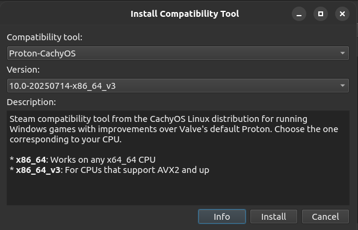
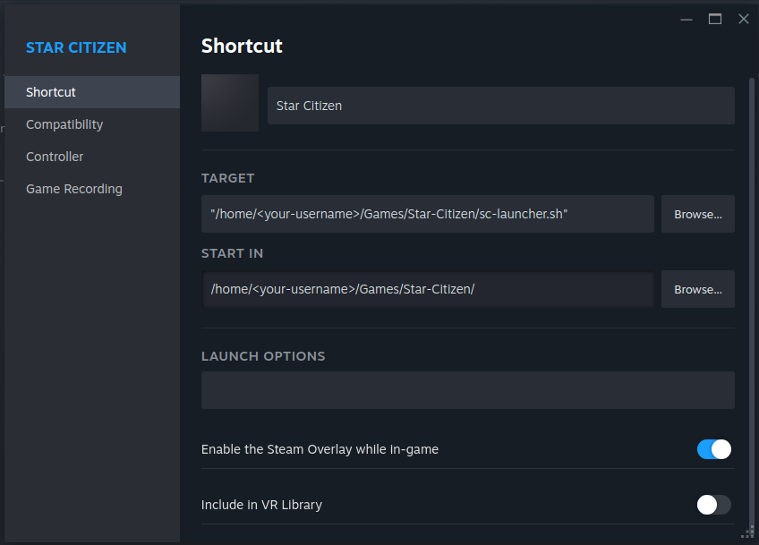
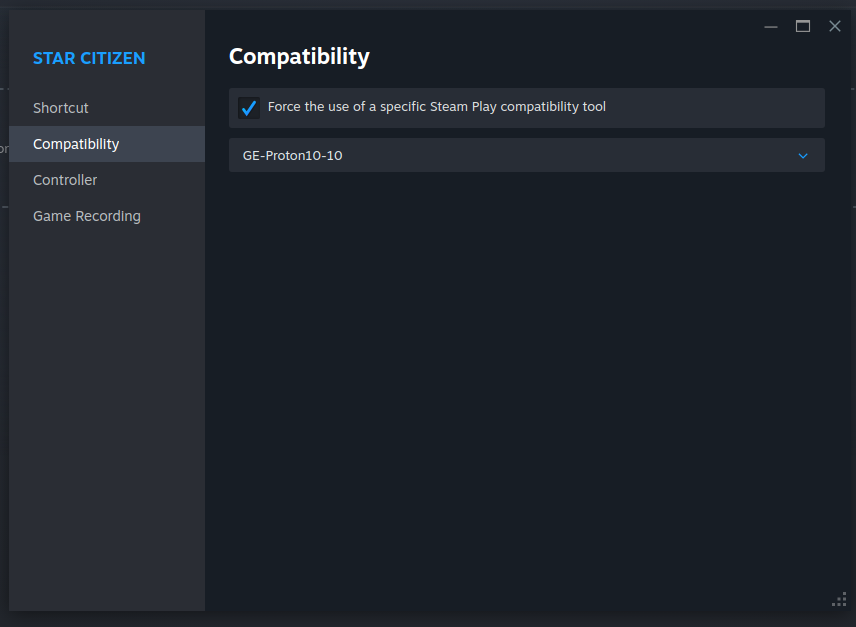

# sc-launcher
**Play Star Citizen on Linux**

## Overview

* This script helps you to install, update and run the latest *Star Citizen* setup launcher from [RSI home](https://robertsspaceindustries.com/en/download) page on Linux using Proton via Steam. Other frameworks like Lutris are not tested.

* If you are not yet a member of Star Citizen Universe, feel free to use this Referrer code: https://www.robertsspaceindustries.com/enlist?referral=STAR-K4DH-PCG3
  You get 5000UEC and I get a small ship. Join my organisation, and I help you to get yours: https://robertsspaceindustries.com/en/orgs/NCFC
  
* I use Fedora as it seems to be most compatible with latest hardware. The script should run on any Linux distribution, as any extra magic is omitted.

## Why Use Steam?

Running Star Citizen through Steam offers several benefits on Linux:

- **Proton Integration**: Steam provides first-class Proton support, allowing compatibility layers to run Windows games like Star Citizen smoothly.
- **Proton compatibility**: Using Wine runners you often need to create workaround because if EasyAntiCheat software. Proton is usually kept wide range compatible. For now I had no issues, except one fixed by CiG few days later. In that particular case Wine had a solution a day after the game patch caused the issue. In general Wine patches are faster. But Proton knows more common issues that are already handled.
- **Shader Cache Management**: Steam handles and caches compiled Vulkan shaders per user and game, reducing stutter and improving performance over time.
- **Isolated Game Data**: Steam keeps game files, Proton prefixes, and shader data organized within a predictable directory structure, simplifying troubleshooting and backups.
- **Proton Updates and Overrides**: You can easily switch or update your Proton version using Steam’s UI or ProtonUP-QT, without affecting other games or applications.
- **Launch Scripts and Compatibility**: Steam makes it easy to pass arguments, use launch wrappers (like `sc-launcher.sh`), and enforce compatibility settings.
- **Library Management**: Steam allows custom installation paths and library folders, which is helpful for managing the large disk space Star Citizen requires.
- **Input and Overlay Features**: Steam Input can be used to configure and remap gamepads or HOTAS setups, and the Steam overlay can provide useful in-game tools, like video recording, screenshots, chat, voip.

**In short:** Steam acts as a convenient and flexible launcher layer, helping to manage the complexity of running a Windows-only game like Star Citizen on Linux with Proton.

I**f you don't like to run the game via Steam and Proton**, and you want to use a wine runner, take a look at: https://github.com/starcitizen-lug/lug-helper. 

## Requirements

- **Steam** client installed (with Proton support enabled)
- **ProtonUP-QT**  installed for downloading and managing Proton versions (flatpak, or https://davidotek.github.io/protonup-qt/).
- **Proton** (other than Steams default, preferably ProtonGE or Proton-CachyOS)

---

## Installation Steps

### 1. Install Proton via ProtonUP-QT if not done already

- Use **ProtonUP-QT** to download your desired Proton version:
  - *Proton GE* is a good option. But some versions do return the wrong exit code and on exiting the game is launched again. You need to stop via Steam client then.
  - *Proton-CachyOS* is potentially better for latest hardware. Has no issues (yet) with the exit code.
  - Example:
    
- Use **ProtonUP-QT** to update your Proton version.

### 2. Prepare Installation Directory

- Place `sc-launcher.sh` in the directory where you want to install Star Citizen. In this directory the Proton prefix (pfx) will be created and the setup launched inside Proton (Wine) VM.

  - Optionally: place a `sc-launcher.env` in same directory, where you can put you proton configuration variables and functions (usually not needed).

- Example installation:

  ```bash
  mkdir -p $HOME/Games/Star-Citizen
  cd $HOME/Games/Star-Citizen
  git clone https://github.com/nonconformist-circle/sc-launcher.git
  cp sc-launcher/sc-launcher.sh .
  chmod +x sc-launcher.sh
  touch sc-launcher.env
  ```

  * You can update the script using `git pull` 

### 3. Add to Steam

- Open Steam and go to:  
  **"Add a Game" → "Add a Non-Steam Game" → "Browse"**  
  Select the `sc-launcher.sh` script, eg. `$HOME/Games/Star-Citizen/sc-launcher.sh`
- On start the script will automatically check If you don't

### 4. Configure Steam Shortcut

- Locate the new shortcut in your Steam Library (name it something like "Star Citizen Launcher").
- Open **Properties**:
  - Under **Shortcut** point to the `sc-launcher.sh`
  - Under **Compatibility**, check:
    > **Force the use of a specific Steam Play compatibility tool**  
    and select the Proton version you installed earlier (GE or CachyOS).
    
  - Pictured example:
    
    
  -  


### 5. Launch the Installer

- Start the game from Steam.
- First start (as any update) may take a while as the latest `RSI Launcher-Setup-X.X.X.exe` is downloaded to the game installation folder.
- The RSI installer will launch. When asked for installation location:
  - You can use the suggested path. This would end up in `/home/<your-profile/Games/Star-Citizen/`
  - Example picture: 
    
  - **Optional** you can choose `Z:\` → navigate to `/` → go to the folder containing `sc-launcher.sh` → "Make New Folder":  `Roberts Space Industries` or what ever you like
  - Pictured
    

### 6. Final Configuration

- After installation completes make sure checkbox "Run RSI Launcher" **is unchecked** and finish the setup.
  
- Launch the game again via Steam.


---

## Notes

- When the game starts, you may see a warning about an untested Windows version — this is expected. Just click OK and continue.
- The `sc-launcher.sh` will check for new RSI Launcher each time. If there is one newer it will download it and run instate of the game. Repeat steps 5 - 6. On next launch the game will start again.
- Enjoy playing Star Citizen on Linux!
